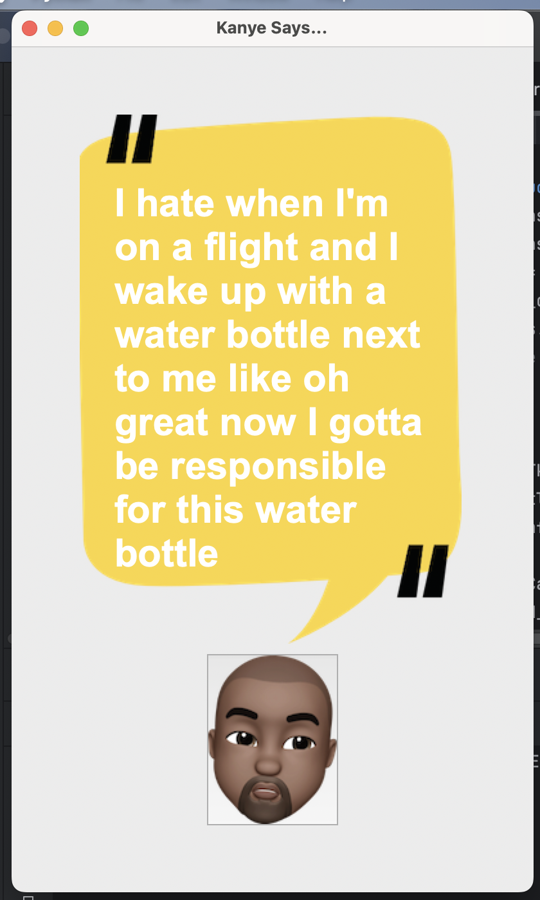

# Kanye Quotes App 

A simple Python Tkinter application that displays random Kanye West quotes using the [kanye.rest API](https://kanye.rest/).

---
### Preview

## Features

- Python Tkinter GUI  
- Fetches and displays random Kanye West quotes  
- API integration with kanye.rest  
- Lightweight and minimal design  

---

## Installation

1. Clone the repository  
2. Install dependencies 

#command to install to be run in terminal 
pip install requests

#How to use 
1.Press the kanye face icon button to get a new quote from kanye 